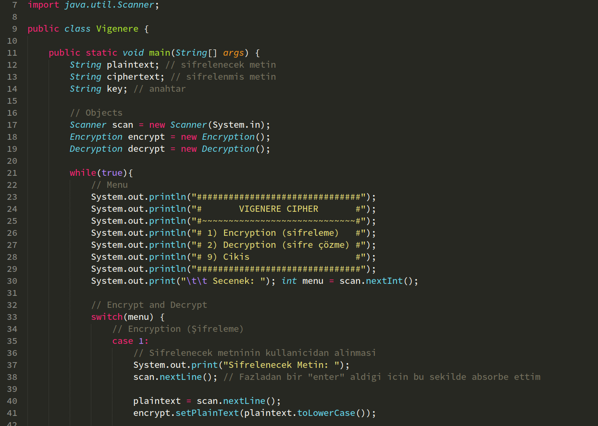
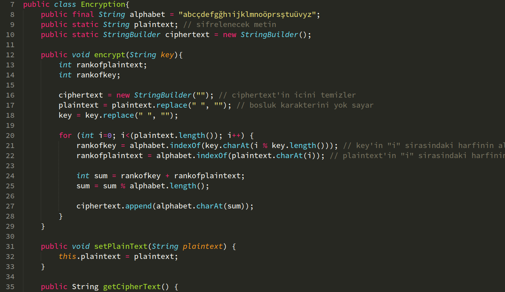
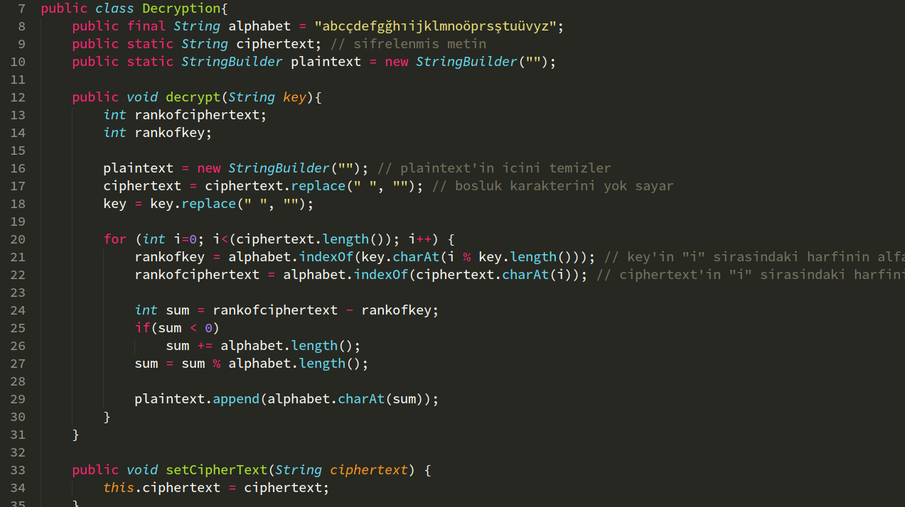
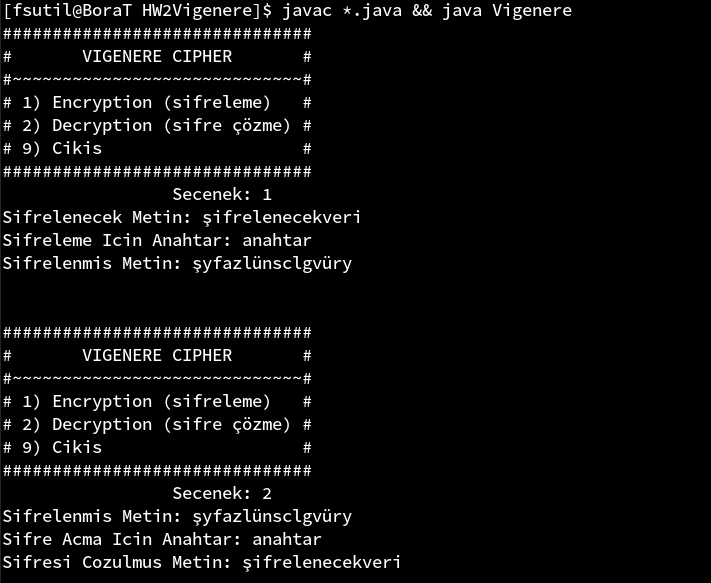
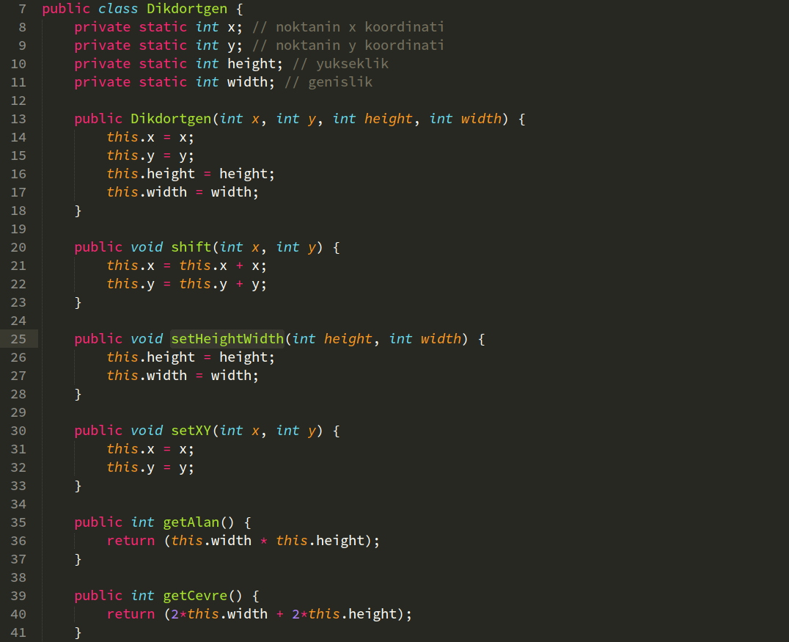
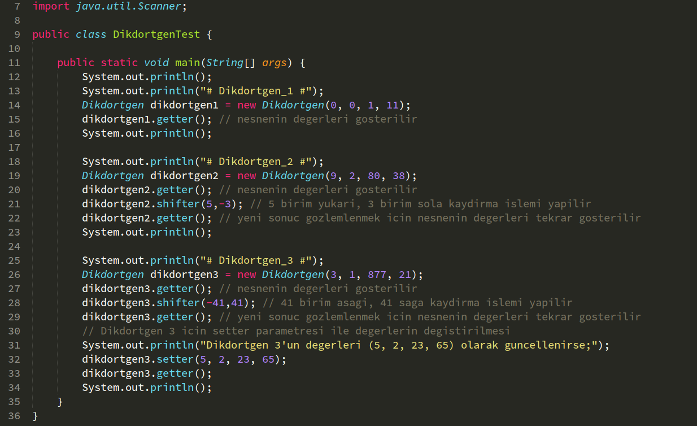
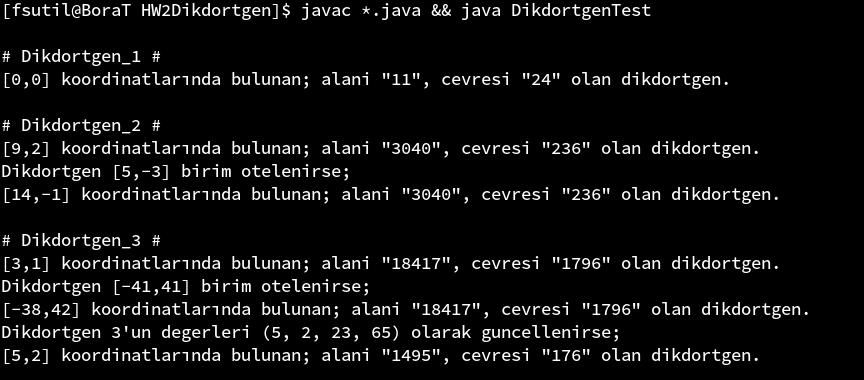

## Ödev 2  - Rapor
<p align="right">
17253509<br>
Bedrettin Bora Tanrıkulu<br>
Bilgisayar Mühendisliği - 1.Sınıf
</p>

## Vigenere Cipher

- Bu proje 3 dosyadan oluşmaktadır.
	Bunlar;  
	&nbsp;&nbsp;&nbsp;&nbsp; **1)** Vigenere.java (main)  
	&nbsp;&nbsp;&nbsp;&nbsp; **2)** Encryption.java  
	&nbsp;&nbsp;&nbsp;&nbsp; **3)** Decryption.java

#### 1) Vigenere.java

- Bu class projenin asıl dosyasıdır. Program bu dosya çalıştırılır. **Main** haricinda başka method'u yoktur. Kullanıcı iletişime bu main method'unda geçilir.

	İçerdiği menu ile Encryption ve Decryption işlemleri gerçekleştirilir ya da programdan çıkış sağlanır.  
	

#### 2) Encryption.java

- Bu class projenin şifreleme işlemini gerçekleştiridiği class'tır.  
	Main tarafından **setPlainText** ile şifrelenmek üzerine bu class'a veri yollanır. Ardından bu veri **Encrypt** method'u ile şifrelenir.

	**Encrypt** method'u kullanıcı tarafından yollanan **Plain Text** ve **Key**'in harflerinin alfabede kaçıncı sıraya geldiğini belirler ardından bu iki değeri toplar. Bu toplamın modunu alır.
	Modu alınan bu değerin alfabede hangi harfe denk geldiğini bulur.  
	Ardından **getCipherText** method'u ile şifreli veri main'e geri yollanır.

	

#### 3) Decryption.java

- Bu class'da Encryption.java'da yapılan işlemin tam tersi yapılır.

	Main tarafından **setCipherText** ile şifresi çözülmek üzerine bu class'a veri yollanır. Ardından bu veri **Decrypt** method'u ile şifrelenir.

	**Decrypt** method'u kullanıcı tarafından yollanan **CipherText** ve **Key**'in harflerinin alfabede kaçıncı sıraya geldiğini belirler ardından bu iki değeri birbirinden çıkarır. Sonuç negatif çıkarsa alfabenin boyutu kadar üzerine ekleme yapılır. Bu sonucun modunu alır.

	Modu alınan bu değerin alfabede hangi harfe denk geldiğini bulur.  
	Ardından **getPlainText** method'u ile şifreli veri main'e geri yollanır.

	

#### Programın Çalıştırılması

- Programı çalıştırmak için aşağıdaki komutu kullanıyoruz;

```
	cd /path/to/HW2Vigenere/
	javac *.java && java Vigenere
```

- Aşağıdaki ekran görüntüsünde de gözüktüğü gibi, Şifrelenmek üzere **"şifrelenecekveri"** metnini ve **"anahtar"** parolasını programa girdiğimizde **"şyfazlünsclgvüry"** olan şifrelenmiş veriyi alırız.

- **"şyfazlünsclgvüry"** şifreli metinin şifresini çözmek için, **"anahtar"** parolası ile şifre çözme yaparsak, metnimiz olan "şifrelenecekveri" 'yi elde ederiz.

	

## Dikdörtgen

- Bu proje 2 dosyadan oluşmaktadır.
	Bunlar;  
	&nbsp;&nbsp;&nbsp;&nbsp; **1)** Dikdortgen.java (main)  
	&nbsp;&nbsp;&nbsp;&nbsp; **2)** DikdortgenTes.java

#### 1) Dikdortgen.java

- Bu class'ta bir dikdörtgenin koordinatları, yüksekliği ve genişliğini içerir. Bu değerler ile dikdörtgenin alanını, çevresini bulabilir. 

	Bu class'ta get ve set işlemlerini kolaylaştırmak için **getter** ve **setter** isminde iki method vardır. Bu sayede aynı anda hem koordinat hem de yükseklik-genişlik belirlenip, geri alınabilir.  
	**shift** method'u ile koordinat düzelminde dikdörtgen kaydırılabilir.

	

#### 2) DikdortgenTest.java

- Bu class sayesinde, Dikdortgen.java 'yı test edebiliriz.
	Test için 3 adet nesne oluşturulmuştur.

	İlk nesne oluşturulduğu gibi gösterilmiştir.  
	İkinci nesne oluşturulmuş, ardından gözlenmiş ve üzerinden kaydırmak işlemi uygulanıp değişime bakılmıştır.

	Üçüncü nesnede ise, ikinci nesneye yapılan işlemlerin aynısı yapılmış ama ek olarak **setter** method'u ile değerler güncellenip tekrar sonuca bakılmıştır.

	

#### Programın Çalıştırılması

- Programı çalıştırmak için aşağıdaki komutu kullanıyoruz;

	```
		cd /path/to/HW2Dikdortgen/
		javac *.java && java DikdortgenTest
	```

	Programın çıktısı aşağıdaki gibidir.

	