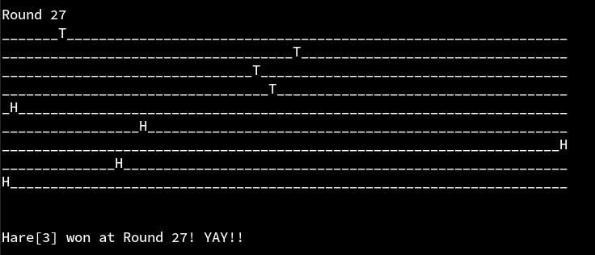
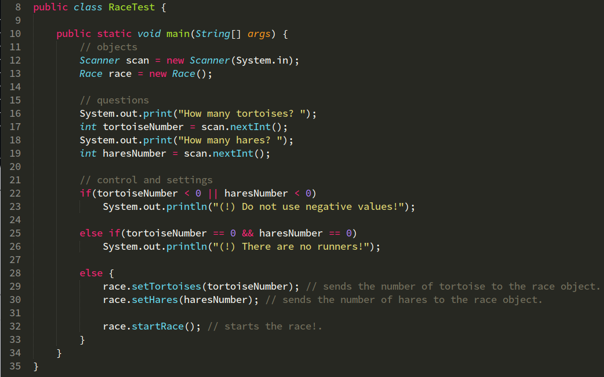
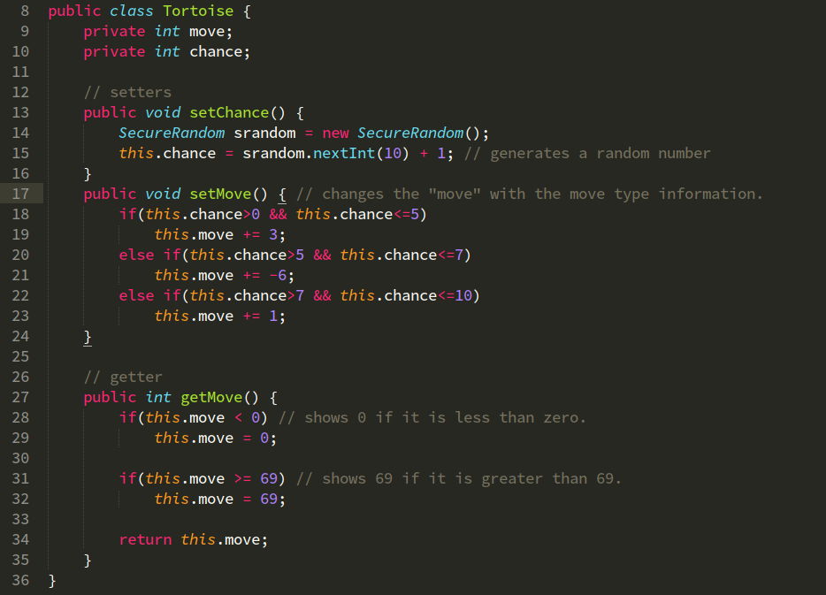
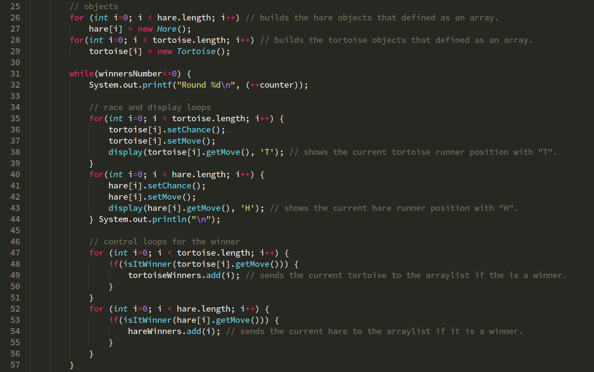
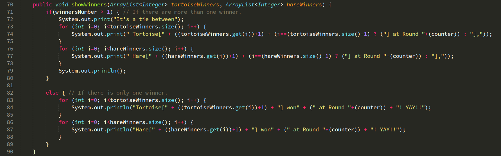
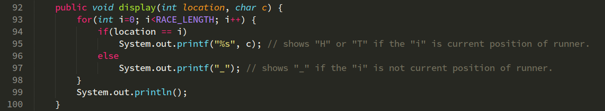

## Ödev 3  - Rapor

17253509 
Bedrettin Bora Tanrıkulu 
Bilgisayar Mühendisliği - 1.Sınıf

## Tortoise and Hare

 
	

- Proje 4 class'tan oluşmaktadır.  
	Bunlar;  
	&nbsp;&nbsp;&nbsp;&nbsp; **1)** RaceTest  
	&nbsp;&nbsp;&nbsp;&nbsp; **2)** Tortoise  
	&nbsp;&nbsp;&nbsp;&nbsp; **3)** Hare  
	&nbsp;&nbsp;&nbsp;&nbsp; **4)** Race

### RaceTest Class'ı

- Projenin test edilmesi için oluşturulmuş bir class'tır. Tortoise ve Hare sayıları kullanıcıdan alındıktan ve gerekli kontroller yapılır. Ardından **race.startRace();** ile yarış başlatılır.

	> Bu class'ta bunun haricinde başka bir işlem yapılmamaktadır.

	

### Tortoise ve Hare Class'ları

- Tortoise ve Hare'in özelliklerini içeren class'lardır. Yapı olarak birbirinin aynısı sayılabilir. 1-10 arasında, **SecureRandom** ile, rastgele bir sayı üretilip Tortoise ve Hare'in özelliklerine uygun hareket tipi tespit edilip **return** ile geri gönderilir.

	> Yarış alanının dışına çıkılmasını engellemek amaçlı; 0'dan küçük değerleri 0'a, 69'dan büyük değerleri 69'a eşitler.

	

### Race Class'ı

- Yarışın gerçekleştiği class'tır. İçersinde 4 method bulunur.
	Bunlar;  
	&nbsp;&nbsp;&nbsp;&nbsp; **1)** startRace  
	&nbsp;&nbsp;&nbsp;&nbsp; **2)** isItWinner  
	&nbsp;&nbsp;&nbsp;&nbsp; **3)** showWinners  
	&nbsp;&nbsp;&nbsp;&nbsp; **4)** display

#### startRace Method'u

- Yarışın gerçekleştiği kısımdır. Diğer method'lar çağırılıp burada kullanılır. Gerekli array oluşturmaları yapıldıktan sonra; kazanan biri olmadıkça döngüde kalan bile **while()** içersinde bulunan **for(;;)**'lar ile yarış işlemi gerçekleştirilir ve aynı zamanda adım adım yarış ekrana basılır.

	Eğer herhangi bir kazanan olursa o anki tur bittikten sonra döngüden çıkılır ve kazananlar ekrana basılır.

	

#### isItWinner Method'u

- Method'a yollanılan yarışcının kazanan olup olmadığını söyler.

	> Aynı zamanda **winnersNumber** değerini artırır. Bu sayede **startRace**'de bulunan **while()** döngüsü kırılmış olur.

	

#### showWinners Method'u

- Yarış bittikten sonra kazanan yarışçıları ekrana basar.

	> Birden fazla kazanan olup olmadığını kontrol edilir, **beraberlik durumu** tespit edilirse; ona göre bir işlem uygulanır.

	

#### display Method'u

- Method'a yollanılan yarışçının 70'lik bir yarış alanındaki konumunu ekrana basar.

	> **startRace** method'unda bulunan **while()** döngüsünde her adımda bu method kullanılarak anlık olarak yarışçı konumları ekrana basılır.

	