## Project

17253509 
Bedrettin Bora Tanrıkulu 
Bilgisayar Mühendisliği - 1.Sınıf

## Flight Tickets

 
	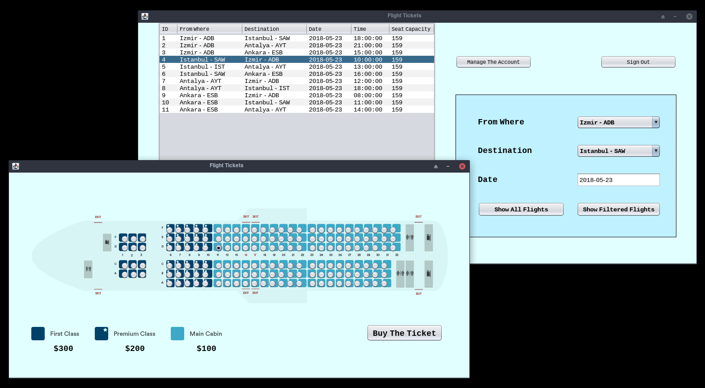

- Proje 3 temel package'a ayrılan 14 class'tan oluşmaktadır.  
	Bunlar;  
	* **CustomerPages**  
		* LoginPage  
		* RegisterPage  
		* BuyTicket  
		* ChooseSeat  
		* PaymentPage  
		* ManageTheAccount
	* **AdminPages**  
		* AdminLoginPage  
		* AdminPanel  
		* AddFlight  
		* UpdateFlight  
		* AddCustomer  
		* UpdateCustomer
	* **DataBaseProcesses**  
		* DataBaseInfo  
		* DataBaseConnecter

**NOT:** UML diyagramı report.md ile aynı klasör altında [UML.pdf](UML.pdf) olarak bulunmaktadır.  
**NOT 2:** Projede database olarak [mariaDB](https://mariadb.org/) kullanılmıştır.

## CustomerPages.LoginPage Class'ı

 
	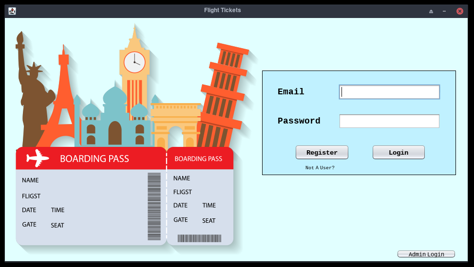

Projenin başladığı noktadır. Müşterilerin giriş yapabilmesi için tasarlanmıştır. İçersinde kayıtlı olmayan müşterilerin kayıt olabilmesi için **registerButton** ve admin girişini sağlanyan **adminLoginButton** bulunur.  

Eğer kullanıcı kayıtlı ise direkt olarak giriş işlemini gerçekleştirirlir. **loginButton**'ına basıldığında alanlara girilmiş değerler okunur ve eğer değerler boş değil ise **login** method'una yollanır.

 
	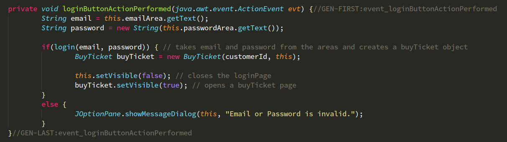

login method'una gelen değerler ile database'de böyle bir user-pass ikilisi olup olmadığına bakılır, eğer böyle bir ikili var ise **true** değer yollanır ve **buyTicket** objesi oluşturulup **setVisible(true)** uygulanır. Kullanıcının olup olmadığı kontrolü **if(resultSet.next())** ile yapılır. Eğer database'de user-pass ikilisine uygun bir satır alındı ise if() bloğu çalışır. Bu sayede kullanıcının database'de olup olmadığı tespit edilmiş olur.Ardından login penceresi setVisible(false) ile kapatılır. Bu sayede login işlemi başarı ile gerçekleşmiş olur.

 
	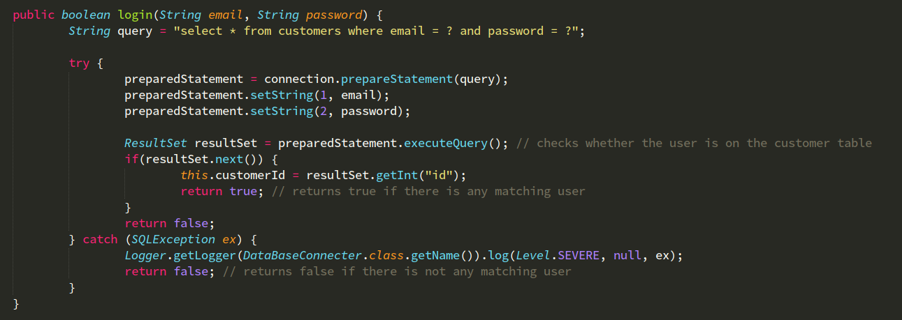

## CustomerPages.Register Class'ı

 
	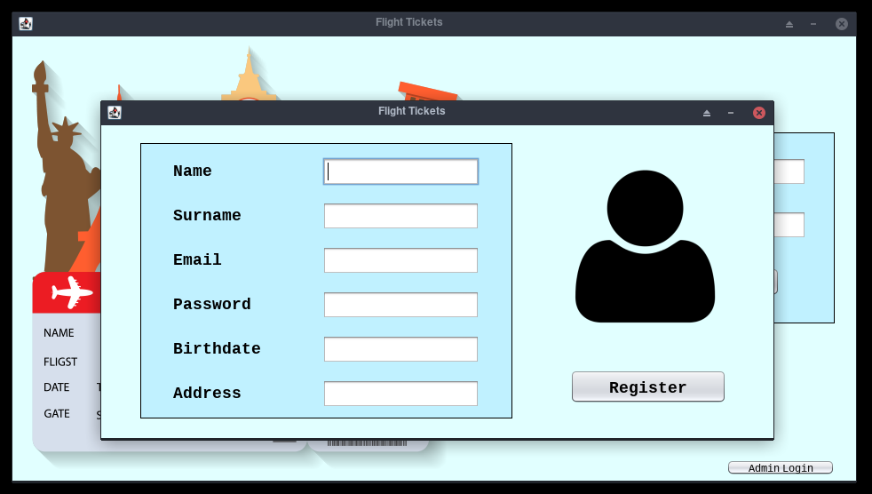

Eğer kullanıcının bir hesabı halihazırda bir hesabı yok ise LoginPage'de bulunan **registerButton** ile kayıt olma sayfasını açar.

Ardından kullanıcıdan temel bilgileri olan Isim, Soyisim, Email, Parola, Doğum Günü ve Adres bilgilerinin girmesi beklenir. Alınan bi bilgilerin eğer hepsi dolu ise **register** method'una yollanır.

 
	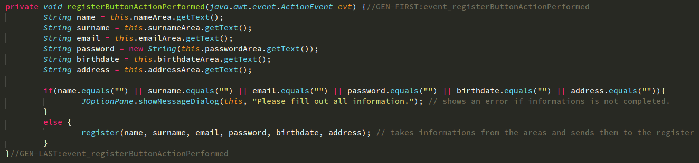

register method'unda alınan bilgiler için Prepared Statement oluşturulur ve database'e yazılmaya çalışınır, eğer bu işlemde herhangi bir exception fırlatması olmaz ise (zaten kayıtlı olan bi email seçilmesi, doğumgünü formatının yanlış olması gibi) kayıt işlemi başarı ile gerçekleşir. Kayıt işlemi gerçekleştikten sonra kullanıcı tekrar **LoginPage**'e yönlendirilir.

 
	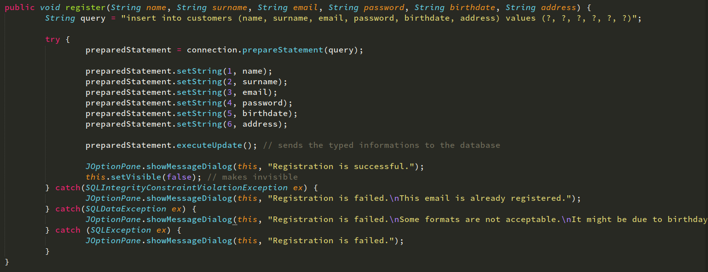

## CustomerPages.BuyTicket Class'ı

 
	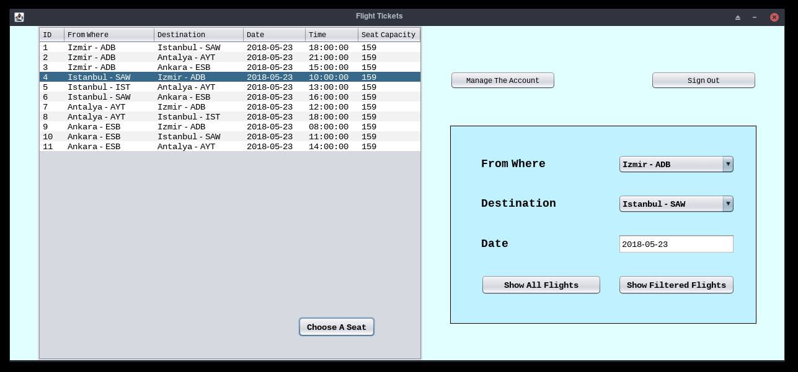

Eğer kullanıcı başarılı bir şekilde login işlemini gerçeklirse programın gövdesi olan **BuyTicket** sayfası ile karşılaşır. Bu sayfada *default* olarak tüm uçuşlar listelenir. Kullanıcıdan sağda bulunan panelde gerekli bilgileri girmesi ve filtreleme işlemini gerçekleştirmesi beklenir. Eğer bu filtrelemeye uygun uçuş(lar) var ise soldaki tabloda gösterilir. Eğer böyle bir uçuş yok ise böyle bir uçuş olmadığına dair bir uyarı mesajı gösterilir.  

BuyTicket çalıştırıldığında *default* olarak tüm uçuşları gösterebilmesi ve sağdaki paneldeki kalkış ve varış istikametlerini otomatik olarak doldurmak için 3 temel method constructor içerinde yürütülür. Bu sayede kullanıcı daha zengin bir ekran ile karşılaşmış olur.

 
	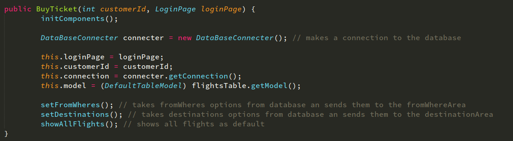

 
	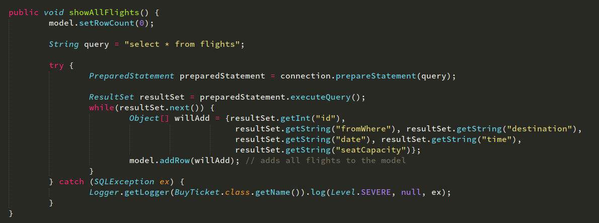

Kullanıcı sağdaki menuden kendisine uygun filtreleme seçeneklerini girdikten sonra **showFilteredFlightsButton**'dan bu değerler **showTickets** method'una yollanır. Burada yollanan değerlere uygun tüm uçuşlar database'den alınır ve eğer var ise soldaki tabloya konur. Olup olmadığını tespit etmek işlemi **while(resultSet.next())** ile yapılır. Buradaki mantık eğer herhangi bir uçuş alınıp resultSet'e atılabildi ise satır oluşmuş demektir, ve while döngüsü satır sayısı kadar çalışmış olur. Bu method ile kullanıcının filtrelemesine uygun tüm uçuşlar tabloya eklenmiş olur.

 
	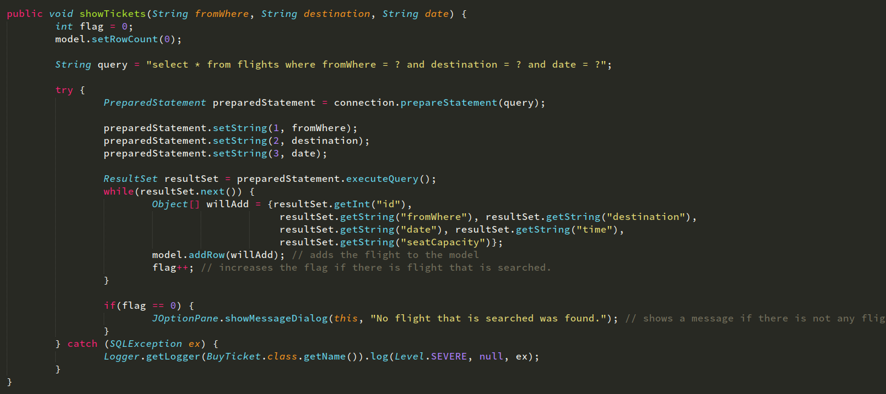

Kullanıcı kendisine uygun uçuşları listeledikten sonra bir uçuş seçip **chooseASeatButton**' basması beklenir. Eğer bir uçuş seçmeden direkt olarak butona basar ise uçuş seçmesi için kullanıcı uyarılır. Eğer uçuş seçildi ise **planeId** ve **customerId** yollanarak , **chooseASeat** objesi oluşturulur ve görülebilmesi için chooseASeat.setVisible(true) yürütülür. Ayrıca chooseASeat objesine **this** yani **buyTicket** objesi yollanır. Buradaki amaç chooseASeat üzerinde yapılan işlemleri anlık olarak buyTicket üzerinde de gösterebilmektir.

 
	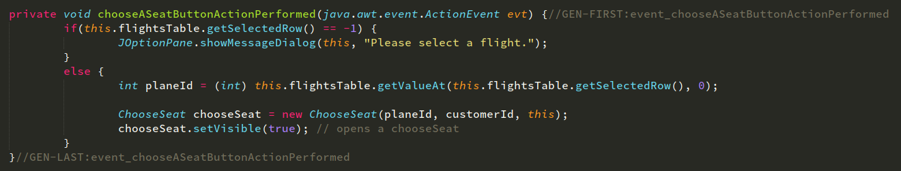

## CustomerPages.ChooseASeat Class'ı

 
	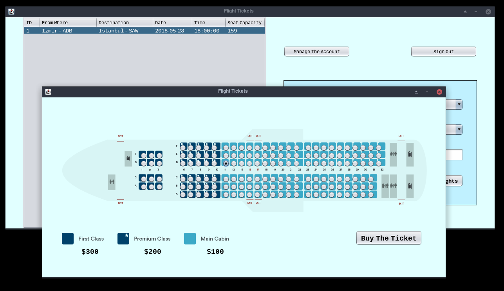

planeId, customerId ve buyTicket objesi yollanarak oluşturulan chooseASeat'te kullanıcıdan kendisine uygun koltuğu seçmesi ve ardından **buyTheTicketButton**'a basması beklenir.

Bu işlemlerin gerçekleşmesi için constructor'da 3 temel method olan **setRadioActionCommands()**, **setUnvisibleTakenSeats()**, **setPrices()** yürütülür.  

 
	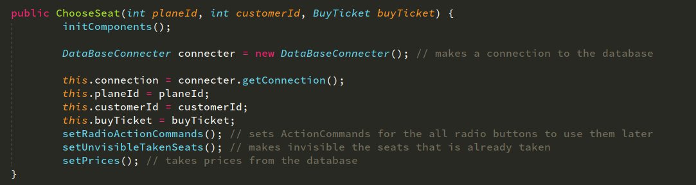

Tüm radio button'ların, daha sonradan kullanılması amacıyla isimlendirilmesi gerekmektedir. Bunun için radio button'lardan oluşan seatButtonGroup'un tüm elemanları AbstractButton türünde bir button'a yazılır ve bu button üzerinde **setActionCommand()** ile isimlendirme işlemi yapılır. Bu sayede kullacının hangi koltuğu seçtiği tespit edilebilir ve database'e yazılabilir olmuş olur.  

 
	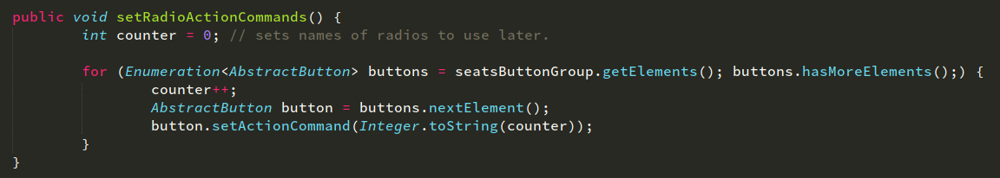

Ayrıca uçağın mevcut durumunu gösterebilmek için, satılmış tüm koltukların radio button'larını gözükmez yapılması gerekir. Bu işlem için de setUnvisibleTakenSeats() method'u constructor'da yürülür. Bunun için tüm radio button'lara tek tek bakılır eğer sold_tickets'da o planeId ve seatNumber ikilisi mevcut ise **setVisible(false)** yürütülerek radio button'ın görünmez olması sağlanır.

 
	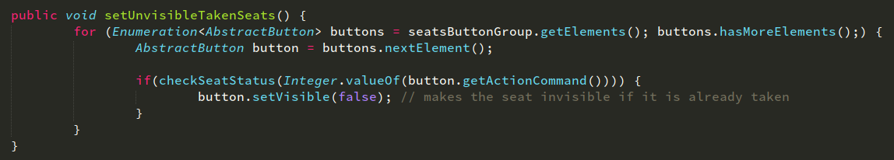

 
	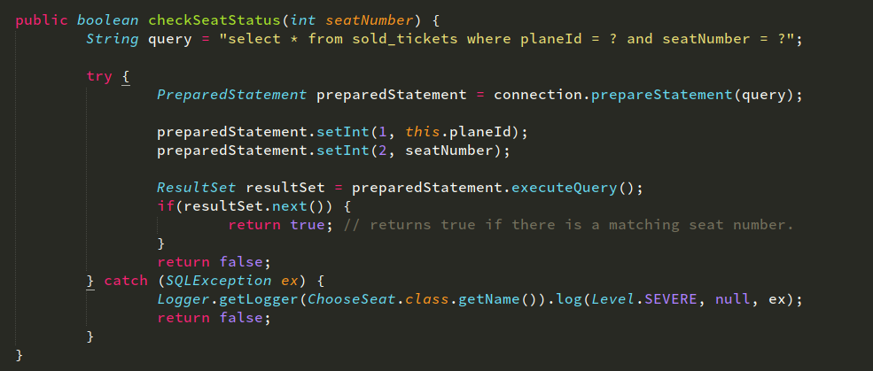

Bunlara ek olarak kullanıcının kendi bütçesine uygun koltukları seçebilmesi amacıyla, database'den koltuk fiyatları alınır ve kendilerine uygun label'lar için **setText()** ile yazılır. Bu sayede chooseASeat uçağın durumuna uygun şekilde kullanıcının karışına çıkmış olur.

 
	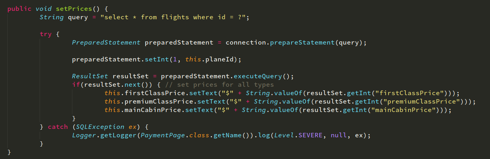

Kullanıcı eğer koltuk seçmeden direkt olarak **buyTheTicketButton**'a basar ise koltuk seçmesi için uyarılır, eğer koltuk seçtiyse ödeme sayfası olan **paymentPage** oluşturulur ve görünür hale getirilir. Koltuğun ödeme sayfasında direkt olarak satılabilmesi için **planeId**, **customerId**, **seatNumber**'in yollması gerekir ayrıca sonucu direkt olarak **chooseASeat**'da da görebilmek için this yazılarak obje de yollanır.

 
	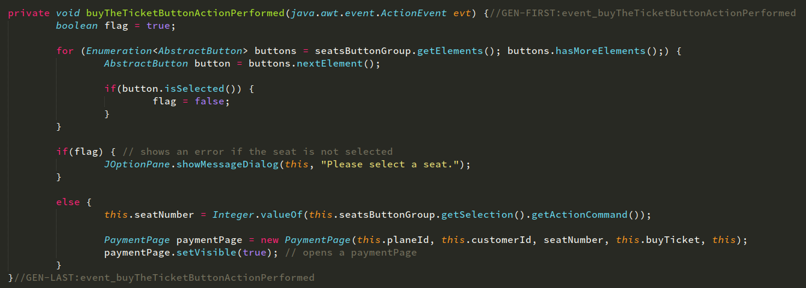

## CustomerPages.PaymentPage Class'ı

 
	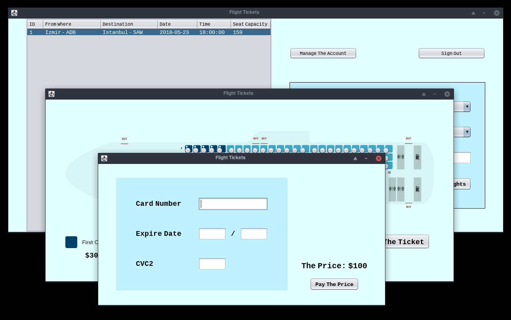

Kullanıcıdan gerçek anlamda kredi kartını girmesi beklenmediği bu class program bütünlüğü oluşturabilmek amacıyla eklenmiştir. İstenen veriler boş olarak girilir ise kullanıcı uyarılır, istenen veriler dolu ise koltuk satışı direkt olarak yapılabilir. Ayrıca fiyat göstermek amacıyla mevcut koltuk numarasında uygun fiyat database'den çekilerek ekrana yazılır.  

Kullanıcı kendisinden istenen verileri girdikten sonra artık satın alma işlemi gerçekleştirilir. Temel olarak bir bilet satışının yapılabilmesi için planeId, customerId ve seatNumber değerlerinin database'da bulunan **sold_tickets** tablosuna yazılması gerekir. Yazılma işleminin ardından Kullanıcı bileti satın aldığına dair bilgilendirilir. Buna ek olarak uçuşlar listelendiğinde kullanıcıyı bilgilendirmek amacıyla konulan, kalan koltuk sayısını gösteren, seatCapacity değeri de 1 düşürülür.  

Tüm bu işlemler bittikten sonra sonucu direkt olarak arkada bulunan panelde görmek amacıyla chooseSeat.setUnvisibleTakenSeats() yürütülür, bu sayede programa anlık sonuç işlevi katılmış olur. Ayrıca tüm panellerin arkasında bulunan buyTicket da aynı şekilde güncelleme işlemi tabi tutulur.

 
	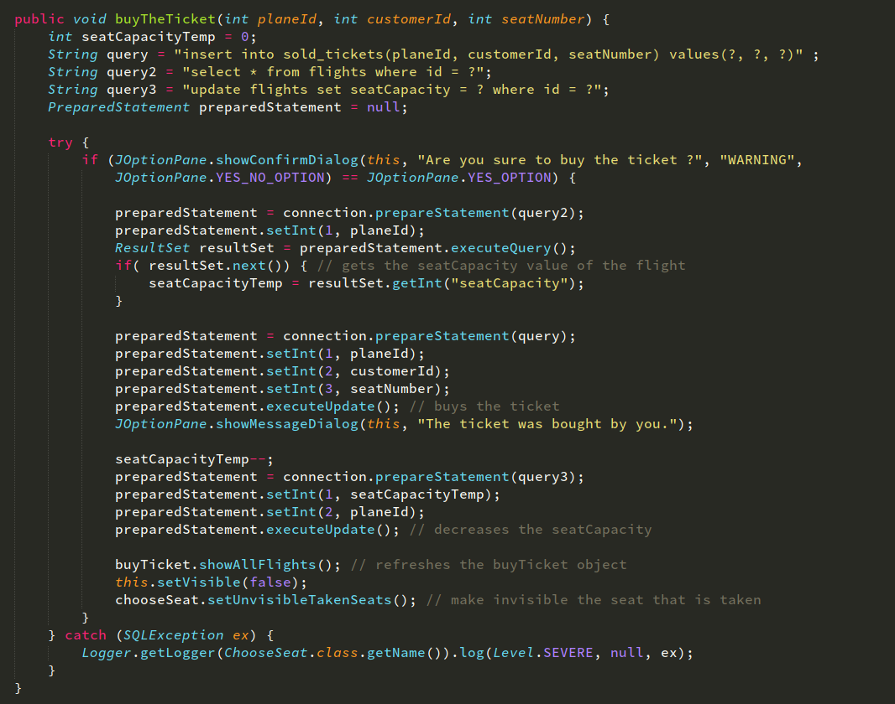

## CustomerPages.ManageTheAccount Class'ı

 
	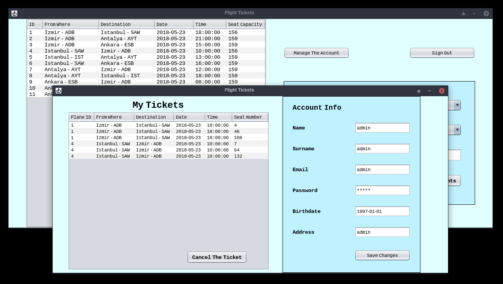

Kullanıcı satın aldığın biletleri **manageTheAccount** üzerinden görebilir. Bu biletleri isterse iptal edebilir. Ayrıca bu sınıfta kullanıcı bilgilerini değiştirebilir.  

Bu bilgilerin kullanıcıya otomatik olarak gösterilebilmesi için constructorda 2 temel method olan **setAccountInfos()**, **setMyTickets()** yürütülür. Bu sayede sol ve sağdaki paneller otomatik olarak dolmuş olur.

 
	

Kullanıcı bilgilerinin sağdaki panelde otomatik olarak gösterilebilmesi için database'de bulunan customers tablosundaki customerId ile eşleşen satır okunur ve bu bilgiler tek tek setText() ile yerlerine yazılır.

 
	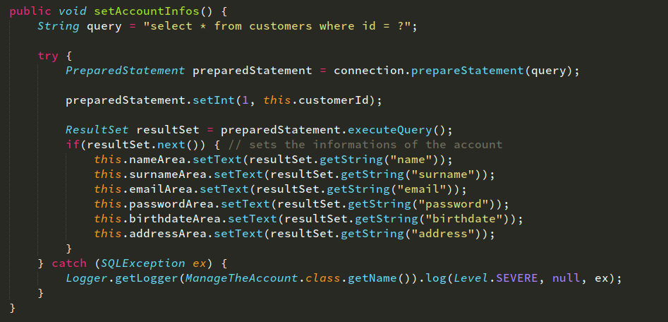

Satın alınan biletlerin soldaki panelde otomatik olarak gösterilebilmesi için sold_tickets tablosunda customerId ile eşleşen tüm satırlar alınır ve bu uçuşu ekrana basabilmek için, satırda bulunan planeId bilgisi alınır ve flights tablosundan planeId ile eşleşen satır okunur, bu değerler willAdd isimli object türünde bir objeye atılır. Ardından bu obje **model.addRow(willAdd)** ile tabloya eklenir.

 
	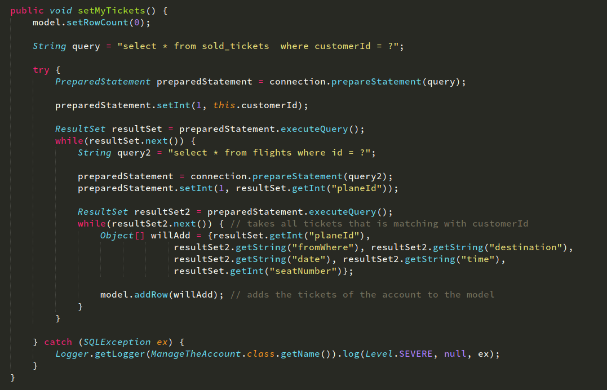

Eğer kullanıcı biletlerinden birini iptal etmek isterse soldaki tablodan biletini seçmesi ve aşağıda bulunan **cancelTheTicketButton**'a basması beklenir. Eğer bilet seçilmeden iptal'e basılırsa kullanıcı uyarılır.

Kullanıcı biletini seçip cancelTheTicketButton'a bastığında emin olup olmadığı sorgusu yapılır, eğer silme konusunda kararlı ise; uçuş'ın mevcut seatCapacity'si **query2** sorgusu ile alınır, ardından **query** sorgusu ile sold_tickets'dan planeId ve seatNumber ikilisi ile eşleşen satırın silme işlemi gerçekleştirilir, ardından uçuşun seatCapacity'sini artırmak amacıyla **query3** sorgusu gerçekleştirilir. Bu şekilde bilet silme işlemi tamamlanmış olur.

 
	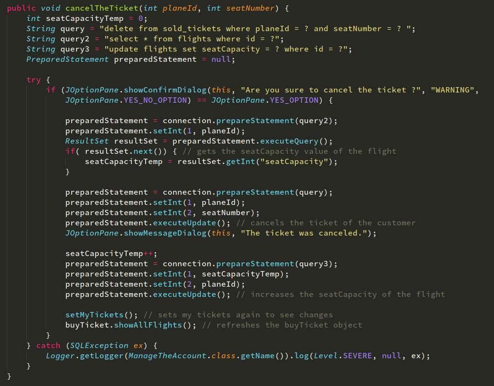

Eğer kullanıcı üyelik bilgilerini güncellemek isterse sağdaki tabloda istediği yeni bilgileri girmesi ve ardından **saveChangesButton**'a basması beklenir. Gerekli kontrolin ardından bu yeni bilgiler **update** sorgusu ile database'de bulunan customers tablosunda customerIs ile eşleşen satıra tekrar tekrar yazma işlemi yapılır. Bu şekilde üyelik bilgilerini güncellenmiş olur.

 
	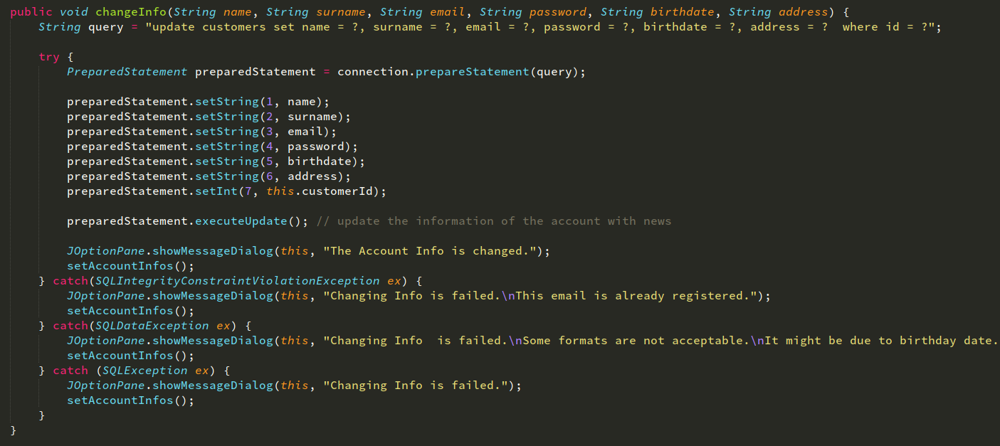

## AdminPages.AdminLoginPage Class'ı

 
	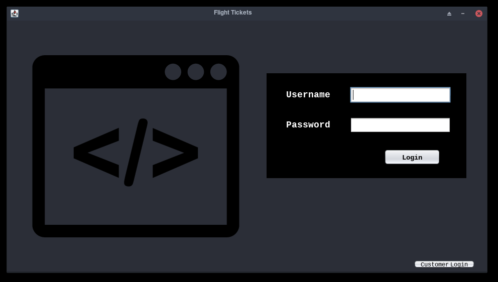

CustomerPages.LoginPage class'ında bulunan adminLoginButton ile ulaşılan class'tır. Bu giriş penceresi ile user-pass ikilisi doğru olanlara AdminPanel class'ı açılır.  

Çalışma mantığı müşteri giriş penceresi ile aynıdır. Eğer database'de bulunan, admins tablosunda girilen user-pass ikilisi ile eşleşen bir ikili var ise giriş işlemi gerçekleştirilir.

 
	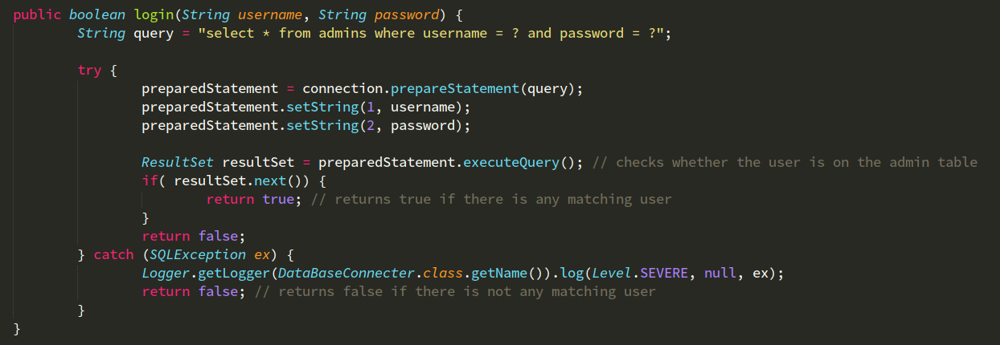

## AdminPages.AdminPanel Class'ı

 
	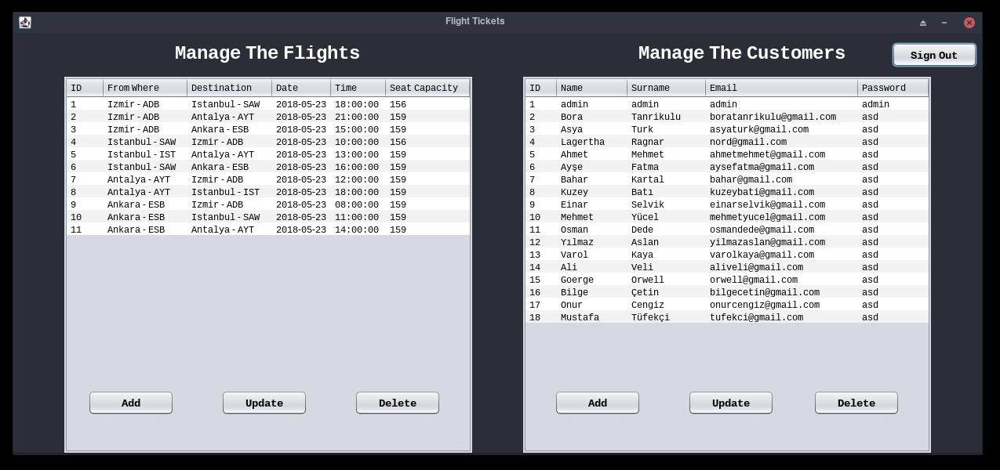

Uçuş ekle/güncelle/sil ve müşteri ekle/güncelle/sil işlemlerinin yapılabildiği admin'lerin kullanabilmesi için tasarlanmış detaylı bir sayfadır.

Direkt olarak uçuş ya da müşteri ekleme işlemleri kolaylıkla yapılabilir.

Sol ve sağdaki panellerin otomatik olarak olarak dolabilmesi için constructor içinde iki temel method olan **showFlights()**, **showCustomers()** yürütülür. Bu iki method'unda çalışma mantığı aynıdır, flights ve customers tablolarındaki tüm satırları okur ve direkt olarak ilgili panellerdeki tablolara satır satır ekler.

 
	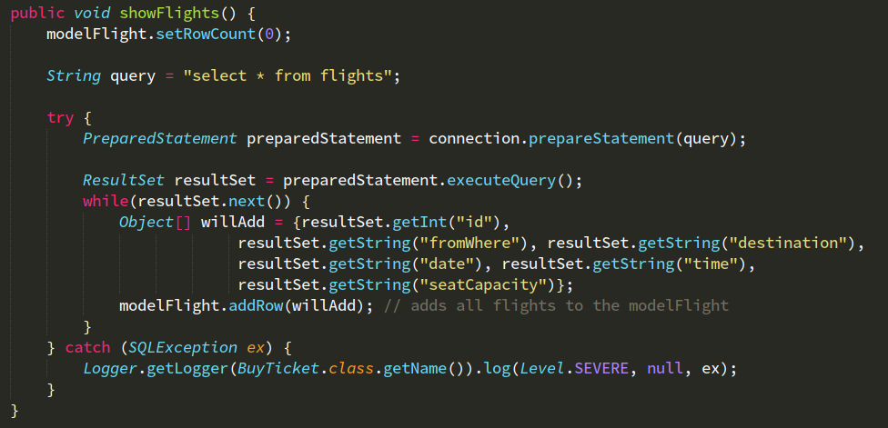

Eğer bir uçuş silinmek istenir ise seçilen satırdan uçuş id değeri okunur ve flights tablosundaki karşılı **delete** sorgusu ile silinir. Ama burada unutulmaması gereken bir nokta vardır. Eğer bir uçuş silinir ise sold_tickets tablosunda bulunan biletler de silinmelidir. Aksi halde yolcular iptal edilen uçuşlara hala biletilerinin olduğunu görecektir.

 
	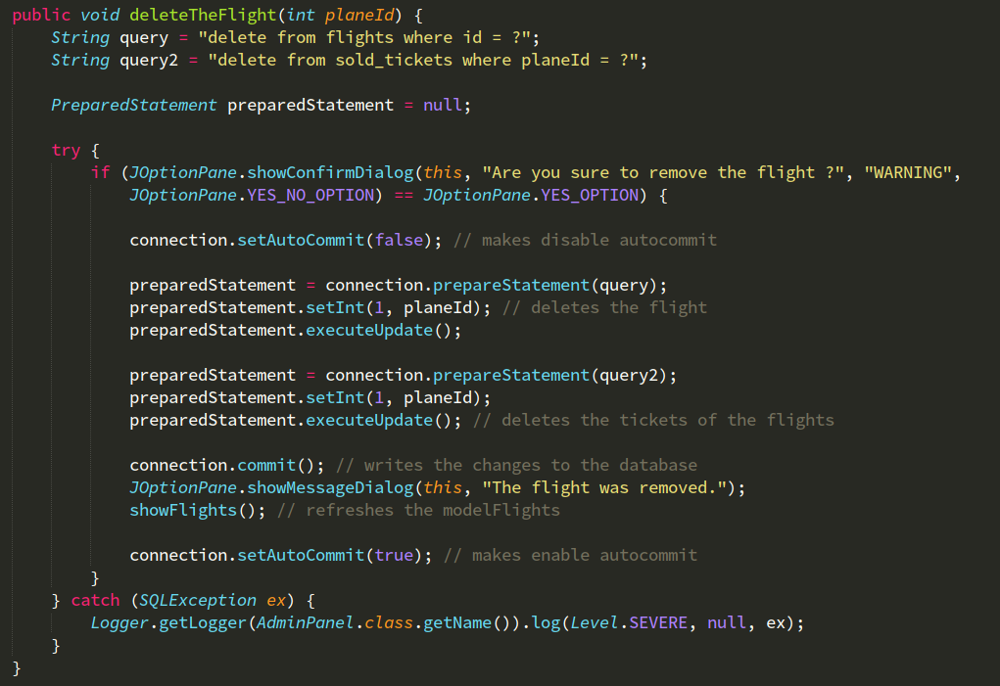

Eğer bir müşteri silinmek istenirse biraz daha karışık ama özünde uçuş silinmesi ile aynı bir method çalışır. Müşteri silinir ise, customers tablosundaki karşılığı ve aldığı tüm biletlerin silinmesi gerekir. Ama burada da atlanması gereken önemli bir kısım vardır, eğer bir bilet silinir ise flights tablosunda bulunan seatCapacity değeri bir artırılmalıdır.

Bu iki işlemde de **autoCommit** devre dışı bırakılarak olası problemler yaşanması halinde işlemin database'e yazılması engellenir.

> Ayrıca bu iki işlem için de yorum satırlarında gerekli açıklamalar ekran görüntülerinde gözüktüğü gibi detaylı olarak eklenmiştir. Algoritmanın daha iyi anlaşılması açısından okunmanızı öneririm.

 
	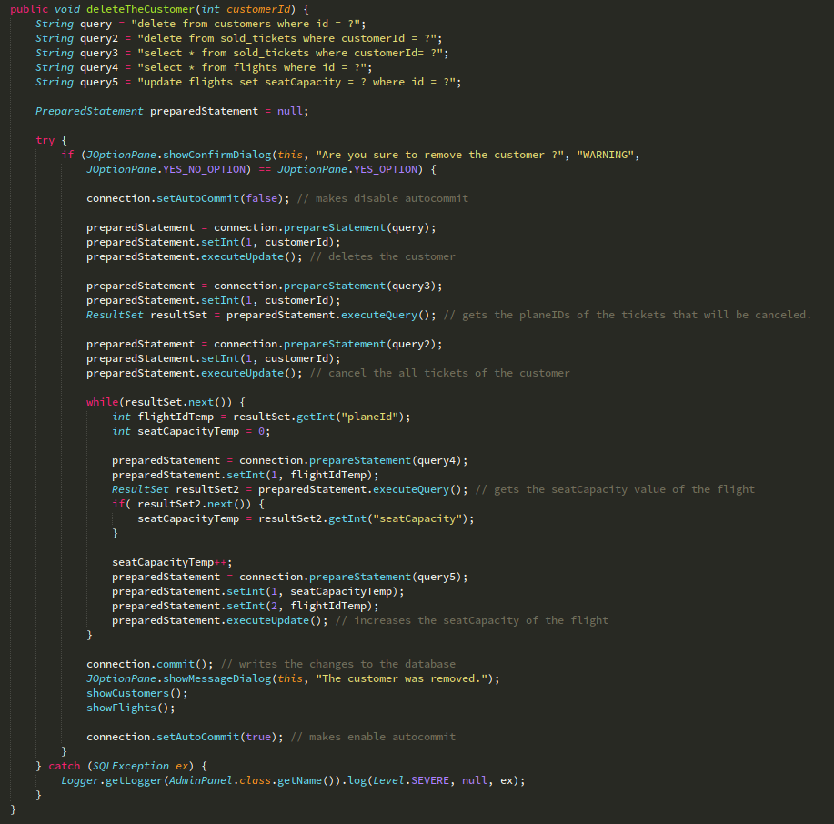

## AdminPages.AddFlight

 
	

> Hem uçuş hem de müşterilerin eklenmesi ve güncellenmesi işlemi özünde aynı olduğu için rapor üzerinde sadece uçuş eklenmesini ve güncellenmesinin anlatılması yeterli olacaktır. Diğer işlemlerin detayları yorum satırları ile daha detaylıca anlaşılabilir.  

Uçuş eklenmek istendiğinde admin'in kalkış havalimanını, varış limanınını, tarih ve saati girmesi gerekir. Eğer değerlerin hepsi girilmez ise uyarılır. Değerlerin girilişi doğru ise bu değerler **addTheFlight()** method'una yollanır.

 
	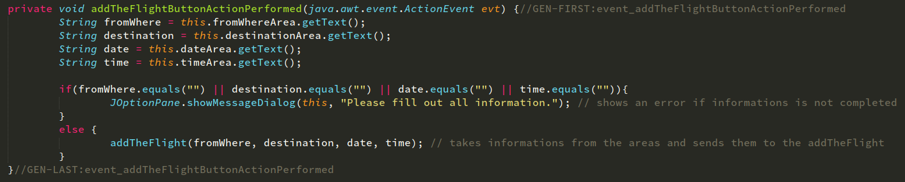

Method aldığı değerleri preparedStatement içersinde yerlerine koyduktan sonra **insert** sorgusu ile database'e ekleme işlemi gerçekleştirişir, ekleme işlemi gerçekleştikten sonra kullanıcı işlemin başarılı olduğuna dair bilgilendirilir. Eğer veri formatlarında yanlışlık var ise database'e yazma işlemi gerçekleşemez ve exception yakalaması gerçekleşir ve admin'e uyarı gösterilir.

 
	

## AdminPages.UpdateFlight

 
	

Class çalıştırıldığında seçilen uçağın bilgilerinin otomatik olarak gelmesi için constructor içinde **showTheFlight()** methodu yürütülür. Bu method basit olarak, flights tablosunda planeId ile eşleşen satırı alır ve field'lara yerleştirir.

 
	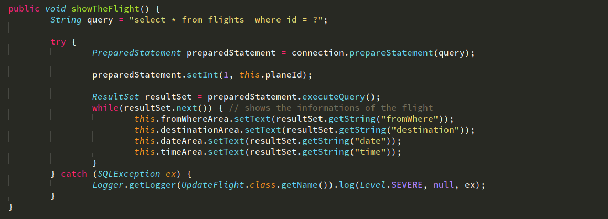

Eğer admin bu değerleri değiştirmek istiyor ise direkt olarak değiştirip, **updateTheFlightButton**'a basması yeterlidir. Buton ardından bilgileri **updateTheFlight()** method'ına yollar ve database'deki ilgili satıra güncelleme işlemi uygulanır.

 
	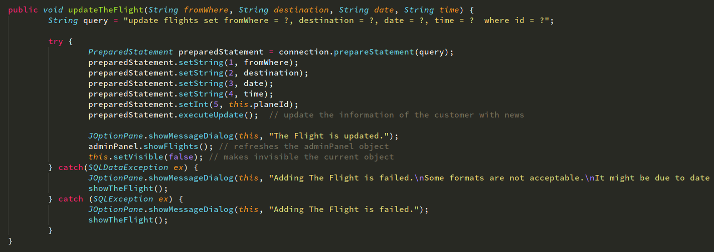

## DataBaseProcesses.DataBaseInfo Class'ı

 
	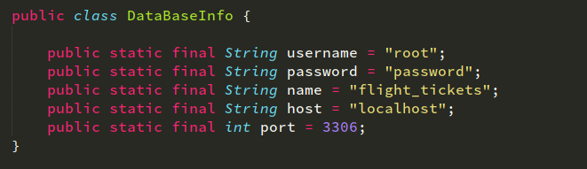

DataBase ile bağlı kurmak için gerekli bilgilerin tutulduğunu class'tır, DataBaseConnecter class'ı tarafından kullanılır.

## DataBaseProcesses.DataBaseConnecter Class'ı

 
	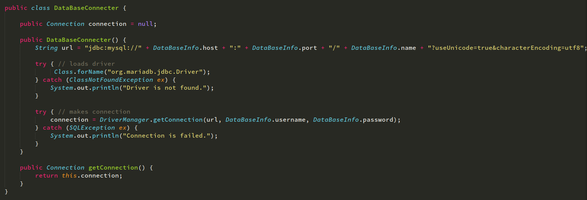

DataBase ile bağlantının sağlandığı class'tır. Bağlantı işlemi constructor'da yapılır bu sayede obje oluştuğu gibi bağlantı kurulmuş olur. Diğer class'lar tarafından bağlantının kullanılabilmesi için getConnection() şeklinde bir method'a sahiptir. Class'ların DataBaseConnecter'ı oluşturması ve getConnection() ile bağlantıyı alması database ile bağlantı kurması için yeterli olacaktır.